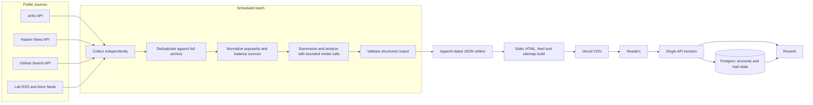

# NewsAI architecture and delivery plan

## Product promise

NewsAI publishes a dated, source-linked AI news edition for builders in India.
The pipeline may summarize an item's own public title and description, but it
must say what evidence it saw and link back to the original. Readers can browse
without an account; accounts only store bookmarks and preferences.

## System shape

The archive is the canonical public content store. A digest commit is the
publication event. Vercel builds static routes from the committed editions;
runtime requests go to one Node function and Postgres. Batch credentials are
limited to GitHub Actions; app/database/email credentials live only in the
services that need them.

## Invariants worth protecting

1. No model decides whether a story is important. Popularity is compared
   within a source, decayed by freshness, and the edition limits crowding.
2. The model sees only the item text it was given. An analysis states its
   evidence limits and its link points to the original item.
3. A failed source can be skipped; all sources failing or all summaries failing
   must fail the run without publishing an empty day.
4. A published day is immutable to automatic retries. New editions are
   written atomically. Dedupe reads the complete history even though homepage
   rendering uses a smaller window.
5. Email is sent only to confirmed addresses. A confirmation link is sent
   immediately when configured; sender retries share a database claim.
6. Reset tokens are single-use and short-lived. Password reset revokes
   sessions. Account deletion checks the current password and removes the
   account's private data.
7. Static HTML is a complete reading experience without JavaScript. Account,
   save and preference controls may use the same-origin API.

## Current request paths

| Request | State read/written | External service |
|---|---|---|
| Scheduled edition | append JSON archive | source APIs, Gemini |
| Static build | read archive, replace generated `public/` | Vercel build |
| Login, saves, prefs | sessions/users/saves | Postgres |
| Subscribe or digest preference | subscriber row + send claim | Resend when configured |
| Password recovery | SHA-256 token hash + expiry | Resend |
| Account deletion | verify scrypt, remove user-linked data | Postgres |

## Gaps and order of work

### P0: Make the first production edition possible

- Add `GEMINI_API_KEY` to GitHub Actions. The latest daily run currently fails
  before collection because this secret is missing.
- Configure Vercel `DATABASE_URL`, `NEWSAI_MAIL_SECRET`,
  `NEWSAI_SITE_URL`, and `RESEND_API_KEY`; verify the sender domain before
  enabling production email.
- Run one manual digest, inspect its linked sources and analyses, then check
  the Vercel build and `/api/health`.

### P1: Improve source evidence and operations

- Add source-level fixtures and freshness/coverage reporting. Alert when all
  feeds fail, a feed silently goes empty, or no edition is published.
- For selected analyses, fetch the linked public primary document when it
  allows it; preserve the evidence text and citations in the edition. Do not
  claim full-text analysis when only an abstract was available.
- Add a manual-review path for high-impact policy or safety claims.
- Record model and prompt version in the JSON so an edition can be audited.

### P2: Reader trust and reach

- Add privacy and contact pages with the actual retention and deletion policy.
- Add social preview images and visually inspect desktop and mobile pages in a
  real browser.
- Add an export option before account deletion and an admin-independent,
  documented recovery procedure for database backups.

## Operating checks

- `npm test`: memory API tests, real Postgres SQL through PGlite, mail and
  pipeline regressions.
- `npm run sources`: read-only current source and selection check.
- `npm run daily`: use only with a configured model key; writes the day's
  edition and renders the static site.
- GitHub Actions `checks`: runs tests and a clean render on code changes.

Production mail and the live model call are external integration checks. They
cannot pass until the corresponding service credentials and sender domain are
configured. Never put those credentials in source control or chat.
